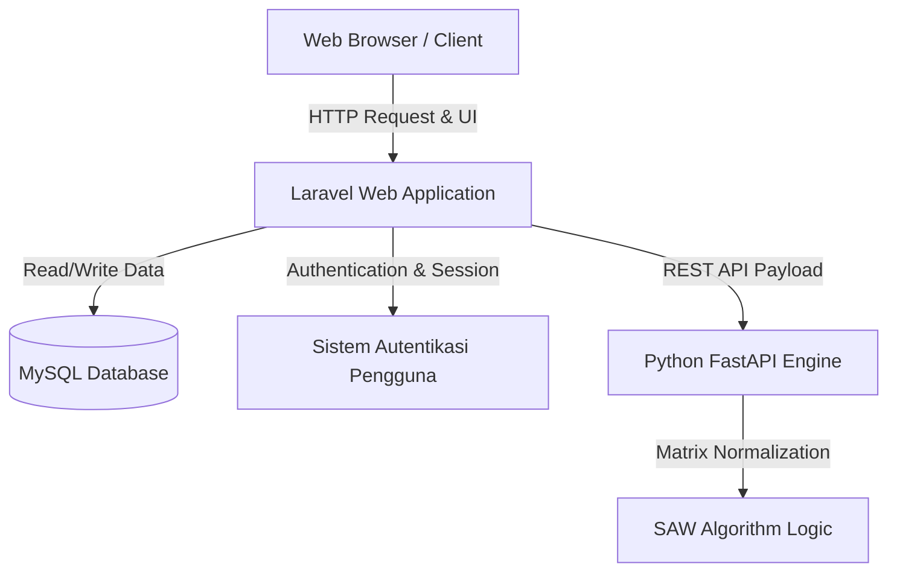

<div align="center">
  
  
  # Ngafein

  Sistem Rekomendasi Kafe Berbasis Machine Learning dan Web Application.

  [](https://laravel.com)
  [](https://python.org)
  [](https://tailwindcss.com)
  [](https://mysql.com)
  [](https://scikit-learn.org)

</div>

---

## Deskripsi Proyek

Ngafein adalah platform sistem rekomendasi kafe cerdas yang dirancang menggunakan metode Simple Additive Weighting (SAW). Sistem ini membantu pengguna menemukan kafe yang optimal untuk berbagai kebutuhan (seperti bekerja, belajar, atau bersosialisasi) dengan mengevaluasi preferensi spesifik pengguna terhadap kriteria dinamis termasuk harga, jarak, penilaian (rating), kelengkapan fasilitas, dan variasi menu.

Dengan memanfaatkan arsitektur yang terpisah (decoupled), Ngafein memberikan pengalaman pengguna yang responsif sekaligus memproses perhitungan matriks rekomendasi yang kompleks secara efisien pada layanan mikro (microservice) terdedikasi.

## Integrasi Algoritma SAW

Logika inti dari Ngafein bergantung pada algoritma Simple Additive Weighting (SAW). Metode Multi-Attribute Decision Making (MADM) ini menghitung jumlah terbobot dari nilai kinerja setiap alternatif pada semua atribut.

1. **Normalisasi Kriteria:** Sistem menormalisasi kriteria berbasis manfaat (benefit) seperti fasilitas dan penilaian, serta kriteria berbasis biaya (cost) seperti harga dan jarak untuk membangun matriks standar.
2. **Pembobotan Preferensi:** Bobot dinamis yang ditetapkan untuk setiap kriteria dikalikan dengan matriks yang telah dinormalisasi.
3. **Pemeringkatan Alternatif:** Jumlah kumulatif menentukan skor akhir dan peringkat untuk setiap kafe, memastikan hasil rekomendasi yang sangat personal.

## Arsitektur Sistem

Ngafein memanfaatkan arsitektur modern yang memisahkan lapisan antarmuka pengguna dari lapisan komputasi matematika tingkat lanjut:



## Fitur Utama

Kemampuan sistem dikelompokkan secara logis menjadi operasi administratif dan fitur yang berfokus pada pengguna.

| Modul | Fitur | Deskripsi |
| :--- | :--- | :--- |
| **Pengguna** | Rekomendasi Cerdas | Menghasilkan peringkat kafe yang dipersonalisasi menggunakan evaluasi SAW. |
| **Pengguna** | Penyaringan Lanjutan | Menyaring kafe berdasarkan jarak, jam operasional, rentang harga, dan penilaian minimum. |
| **Pengguna** | Pusat Interaksi | Memungkinkan pengguna untuk mengirimkan ulasan, menyimpan favorit, dan memblokir kafe yang tidak diinginkan. |
| **Pengguna** | Pengajuan Kafe | Memungkinkan pengguna untuk berkontribusi dengan mengusulkan entri kafe baru. |
| **Admin** | Manajemen Data Induk | Mengelola identitas kafe, pemetaan fasilitas, dan katalog menu. |
| **Admin** | Kendali Kriteria SAW | Memungkinkan penyesuaian bobot kriteria secara dinamis untuk kalibrasi algoritma. |
| **Admin** | Dasbor Statistik | Memberikan wawasan analitis mengenai interaksi pengguna dan popularitas kafe. |

## Tumpukan Teknologi (Tech Stack)

Infrastruktur aplikasi memanfaatkan kerangka kerja dan pustaka standar industri yang tangguh.

| Komponen | Teknologi | Versi / Detail |
| :--- | :--- | :--- |
| **Kerangka Kerja Backend** | Laravel (PHP) | v10.x |
| **Antarmuka Pengguna (UI)** | Blade, Tailwind CSS | Native Server-Side Rendering |
| **API Mesin Matematika** | FastAPI (Python) | v0.100+ |
| **Pemrosesan Algoritma** | Pandas, Numpy, Scikit-Learn | Penataan data dan operasi matematika |
| **Mesin Basis Data** | MySQL | Penyimpanan Data Relasional |
| **Pengujian Otomatis** | PHPUnit, Pytest, Playwright | Cakupan pengujian Unit, Fitur, dan E2E |

## Struktur Repositori

Repositori ini disusun sebagai monorepo yang berisi lingkungan yang berbeda.

```text
/
├── engine/                 # Lingkungan Python untuk komputasi SAW
│   ├── app/                # Logika aplikasi FastAPI dan router
│   ├── data_pipeline/      # Skrip untuk penyerapan dan pra-pemrosesan data
│   └── tests/              # Modul Pytest untuk validasi matematika
├── web-app/                # Lingkungan Laravel untuk aplikasi utama
│   ├── app/                # Komponen arsitektur MVC (Model, Pengontrol)
│   ├── database/           # Migrasi, pabrik (factories), dan penyemai (seeders) cerdas
│   ├── resources/          # Aset frontend, tampilan, dan konfigurasi Tailwind
│   └── tests/              # Pengujian PHPUnit untuk integrasi API dan logika bisnis
└── docs/                   # Cetak biru arsitektur dan dokumentasi pengujian
```

## Instalasi dan Pengaturan

### 1. Persyaratan Sistem
- PHP 8.1+ & Composer
- Python 3.10+
- Node.js & npm
- Server MySQL

### 2. Pengaturan Mesin Python (Engine)
Arahkan ke direktori engine untuk menyiapkan layanan mikro komputasi.
```bash
cd engine
pip install -r requirements.txt
python api.py
```
*Catatan: Mesin (engine) beroperasi secara lokal pada port 5000 secara bawaan.*

### 3. Pengaturan Aplikasi Web Laravel
Buka sesi terminal baru dan siapkan aplikasi utama.
```bash
cd web-app
composer install
npm install
cp .env.example .env
php artisan key:generate
```
Pastikan kredensial basis data MySQL Anda dikonfigurasi dengan benar di dalam file `.env` sebelum melanjutkan.

### 4. Migrasi Basis Data & Penyemaian Aset
Platform ini mencakup penyemai otomatis (seeder) yang secara dinamis memetakan aset gambar lokal ke rekaman kafe.
```bash
php artisan migrate:fresh --seed
php artisan storage:link
```

### 5. Menjalankan Server Pengembangan
```bash
npm run dev
php artisan serve
```

## Pengujian Otomatis

Repositori ini menggabungkan protokol pengujian yang ekstensif untuk menjamin integritas sistem.

| Lingkungan | Pelari Pengujian | Perintah |
| :--- | :--- | :--- |
| **Aplikasi Web (PHP)** | PHPUnit | `php artisan test` |
| **Mesin (Python)**| Pytest | `pytest` |

## Tim Pengembang

Proyek ini dikembangkan oleh:

| Pengembang | Nomor Induk Mahasiswa (NIM) | Profil GitHub |
| :--- | :--- | :--- |
| Agita Putri Salsabila Aji | 2341760092 | TBD |
| Afgan Galih F. A. A. | 2341760004 | TBD |
| Arimbi Putri Hapsari | 2341760016 | TBD |
| Indi Warda Ramadhani | 2341760026 | TBD |
| Izzatir Rofi’ah | 2341760010 | TBD |

## Lisensi

Proyek ini dikembangkan sebagai bagian dari **Project Based Learning (PBL)** untuk keperluan akademik. Kode sumber dilisensikan di bawah [Lisensi MIT](https://opensource.org/licenses/MIT). Silakan tinjau file `LICENSE` untuk detail lebih lanjut.
